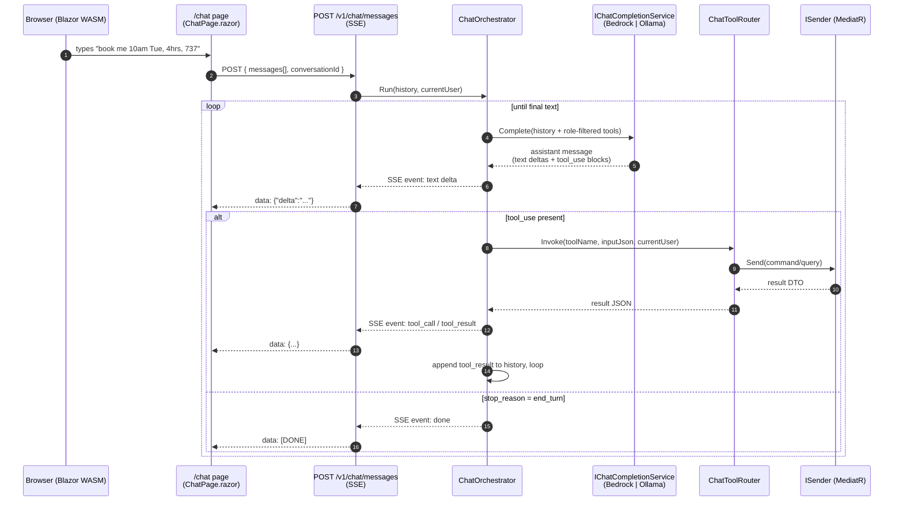

# Plan: FSBS chatbot (`/chat`) — natural-language access to the FSBS API

## Context

The user wants a chatbot UI that lets signed-in users converse with the FSBS API
(`v1.json`) in natural language — book a sim, check availability, look at their
schedule, approve/reject a pending booking, etc. Constraints chosen with the
user:

- Lives inside the existing **FSBS.Web** Blazor WASM SPA as a new `/chat` page,
  backed by a new endpoint group on **FSBS.Api** (no new ECS service, no new
  CDN distribution).
- LLM is **Amazon Bedrock** (Anthropic Claude) in non-development environments;
  a **local LLM** (Ollama, OpenAI-compatible API) is used when
  `DevAuth:Enabled=true`, mirroring the existing Cognito stub pattern in
  `InfrastructureServiceExtensions.cs:40-53`.
- Tool surface: **read + booking lifecycle** (create / cancel /
  approve / reject). No admin CRUD of simulators, no reference-data writes, no
  invitation issuance, no payment recording.
- Both Cognito pools (Staff + Customer). The endpoint sits behind the existing
  default policy (`["Staff","Customer"]` in non-dev), and the tool registry
  filters the advertised tool list by `app_role` at request time.

The chat endpoint dispatches every tool call through **MediatR** (`ISender`) to
the existing command/query handlers — there is no HTTP self-call. This reuses
all validation, transactions, tenant filtering, RLS, and audit interceptors as-is.

## Shape of the change



## Files to add / change

Paths are relative to repo root.

### 1. `src/FSBS.Application/Chat/` (new)

Reuses the existing `ICurrentUser` (`FSBS.Application.Common.Interfaces.ICurrentUser`,
implemented by `FSBS.Api.Auth.CurrentUserService`) and `ISender` from MediatR.

- `Models/ChatModels.cs` — provider-neutral records:
  - `ChatMessage(string Role, string? Text, IReadOnlyList<ChatToolCall>? ToolCalls, ChatToolResult? ToolResult)`
  - `ChatToolCall(string Id, string Name, string ArgumentsJson)`
  - `ChatToolResult(string ToolCallId, string ResultJson, bool IsError)`
  - `ChatCompletionRequest(IReadOnlyList<ChatMessage> Messages, IReadOnlyList<ChatToolDefinition> Tools, string SystemPrompt)`
  - `ChatStreamItem` discriminated union (`TextDelta`, `ToolUseStart`, `ToolUseDelta`, `StopWithToolCalls`, `StopEndTurn`, `Error`)
- `Tools/ChatToolDefinition.cs` — `(string Name, string Description, JsonElement InputSchema, AppRole[] AllowedRoles, Func<JsonElement, ISender, CancellationToken, Task<object>> Dispatch)`. Dispatch closures live next to the registry; each one deserializes the LLM-provided JSON to the existing MediatR command/query type from `FSBS.Application` (e.g. `BookSimulatorSlotCommand`, `GetMyBookingsQuery`, `CancelBookingCommand`, etc.) and returns the response DTO.
- `Tools/ChatToolRegistry.cs` — single `IReadOnlyList<ChatToolDefinition>` of all chat-exposed tools, with a `Filter(AppRole role)` helper. Tool list:

  | Tool name | Underlying MediatR type | Required roles |
  | --- | --- | --- |
  | `list_simulators` | `ListSimulatorsQuery` | any |
  | `get_simulator_availability` | `GetSimulatorAvailabilityQuery` | any |
  | `list_aircraft_types` | `ListAircraftTypesQuery` | any |
  | `list_my_bookings` | `GetMyBookingsQuery` | any |
  | `get_my_bookings_for_range` | `GetMyBookingsForRangeQuery` | any |
  | `get_booking` | `GetBookingByIdQuery` | any |
  | `get_pricing_quote` | `GetPricingQuoteQuery` | any |
  | `get_profile` | `GetMyProfileQuery` | any |
  | `update_profile` | `UpdateMyProfileCommand` | any |
  | `list_instructors` | `ListInstructorsQuery` | any |
  | `get_instructor_schedule` | `GetInstructorScheduleQuery` | any |
  | `list_pending_approvals` | `GetPendingApprovalsQuery` | SystemAdmin, SalesStaff |
  | `create_booking` | `BookSimulatorSlotCommand` | PrivateCustomer, CorporateManager, CorporateStudent, InternalStudent, SalesStaff, SystemAdmin |
  | `cancel_booking` | `CancelBookingCommand` | booker or SalesStaff/SystemAdmin (existing handler enforces) |
  | `approve_booking` | `ApproveBookingCommand` | SalesStaff, SystemAdmin |
  | `reject_booking` | `RejectBookingCommand` | SalesStaff, SystemAdmin |

  Tool input JSON schemas are hand-written as embedded JSON strings for now (kept next to each tool definition for readability) — schema generation from C# types is a follow-up. Names are `snake_case`, matching Anthropic / OpenAI conventions; results are serialised with the API's existing `JsonSerializerOptions` (camelCase). For `create_booking`, the router auto-generates the `Idempotency-Key` (GUID) per invocation so the LLM never has to.
- `IChatCompletionService.cs` — `IAsyncEnumerable<ChatStreamItem> StreamAsync(ChatCompletionRequest, CancellationToken)`.
- `ChatToolRouter.cs` — looks up the tool by name in the registry, checks `ICurrentUser.AppRole` is in `AllowedRoles` (defence in depth — the registry only advertised allowed tools, but a hostile LLM could fabricate a name), deserialises the args JSON into the registered command/query, dispatches via `ISender`, returns the result serialised back to JSON. Wraps exceptions as `ChatToolResult(IsError=true)` with a `ProblemDetails`-shaped error body so the LLM can recover.
- `ChatOrchestrator.cs` — the agent loop. Pseudocode:
  ```csharp
  async IAsyncEnumerable<ChatStreamItem> RunAsync(IReadOnlyList<ChatMessage> history, CancellationToken ct)
  {
      var tools = _registry.Filter(_currentUser.AppRole);
      var working = history.ToList();
      for (var hop = 0; hop < MaxHops; hop++) // hard cap, e.g. 8
      {
          var pendingToolCalls = new List<ChatToolCall>();
          await foreach (var item in _llm.StreamAsync(new(working, tools, SystemPrompt), ct))
          {
              if (item is ChatStreamItem.TextDelta or ChatStreamItem.ToolUseStart or ChatStreamItem.ToolUseDelta)
                  yield return item;
              if (item is ChatStreamItem.StopWithToolCalls s) pendingToolCalls.AddRange(s.Calls);
              if (item is ChatStreamItem.StopEndTurn) { yield return item; yield break; }
          }
          if (pendingToolCalls.Count == 0) yield break;
          working.Add(new ChatMessage("assistant", null, pendingToolCalls, null));
          foreach (var call in pendingToolCalls)
          {
              var result = await _router.InvokeAsync(call, ct);
              yield return new ChatStreamItem.ToolResult(call.Id, result.ResultJson, result.IsError);
              working.Add(new ChatMessage("tool", null, null, result));
          }
      }
      yield return new ChatStreamItem.Error("Max tool hops exceeded.");
  }
  ```
- `ChatServiceExtensions.cs` — `AddChat(this IServiceCollection)`. Registers
  `ChatToolRegistry` (singleton), `ChatToolRouter` (scoped), `ChatOrchestrator`
  (scoped). Called from the existing `AddApplication()` in
  `FSBS.Application/DependencyInjection.cs`.

The system prompt (a single embedded resource string) instructs the model to:
(a) confirm with the user before any mutation, (b) prefer reading the user's
own bookings via `list_my_bookings` rather than asking for IDs, (c) format
times in the user's timezone (timezone passed in the system prompt as a
property derived from `ICurrentUser`), (d) never invent simulator/booking IDs.

### 2. `src/FSBS.Infrastructure/Chat/` (new)

- `BedrockChatService.cs` — implements `IChatCompletionService` via
  `AWSSDK.BedrockRuntime` `InvokeModelWithResponseStreamAsync` against the
  Anthropic Messages-on-Bedrock format (`anthropic_version`, `messages`,
  `tools`, `tool_choice`). Streaming event names: `message_start`,
  `content_block_delta` (text or input_json_delta), `content_block_stop`,
  `message_delta` (stop_reason), `message_stop`. Translates each into a
  `ChatStreamItem`. Model ID from `Chat:BedrockModelId` (default kept in
  `appsettings.json`, currently `anthropic.claude-sonnet-4-6-v1:0` — the value
  is intentionally configurable so it can be bumped without code changes).
- `OllamaChatService.cs` — implements `IChatCompletionService` against the
  OpenAI-compatible endpoint at `Chat:LocalEndpoint`
  (e.g. `http://localhost:11434/v1`). Uses `HttpClient` with
  `stream=true`, parses `data: {...}` SSE chunks, maps OpenAI `tool_calls`
  deltas onto `ChatStreamItem.ToolUseDelta`. Model name from
  `Chat:LocalModel` (default `llama3.1:8b-instruct-q4_K_M`).
- DI wiring inside `InfrastructureServiceExtensions.AddInfrastructure`
  (`src/FSBS.Infrastructure/InfrastructureServiceExtensions.cs:31`), following
  the existing `if (devMode) { stub } else { real }` branch on
  `DevAuth:Enabled`:
  - `devMode == true` → register `OllamaChatService` as `IChatCompletionService`
    and a named `HttpClient` `"OllamaChat"` with the configured base address.
  - `devMode == false` → register `AmazonBedrockRuntimeClient` (singleton, region
    from existing `Aws:Region` binding) and `BedrockChatService` as
    `IChatCompletionService`.
- Add NuGet refs to `src/FSBS.Infrastructure/FSBS.Infrastructure.csproj`:
  `AWSSDK.BedrockRuntime` (pin to a `3.7.*` release line consistent with the
  other AWS SDKs already referenced there).

### 3. `src/FSBS.Api/Endpoints/ChatEndpoints.cs` (new)

- `MapChatEndpoints(this IEndpointRouteBuilder)`. Single route:
  `POST /v1/chat/messages` → `text/event-stream`. Auth required (default
  policy already covers it). Body
  `record ChatRequest(string ConversationId, IReadOnlyList<ChatMessageDto> Messages)`,
  where `ChatMessageDto` is the wire shape and is mapped 1:1 to
  `FSBS.Application.Chat.ChatMessage`.
- Implementation: set `Response.Headers.CacheControl = "no-cache"`,
  `Response.ContentType = "text/event-stream"`, `Response.Headers.Connection = "keep-alive"`,
  disable response buffering
  (`context.Features.Get<IHttpResponseBodyFeature>()!.DisableBuffering()`),
  iterate `await foreach (var item in orchestrator.RunAsync(...))`, write each as
  `event: <kind>\ndata: <json>\n\n` and `await Response.Body.FlushAsync()`. End
  with `data: [DONE]\n\n`.
- Wire into `src/FSBS.Api/Program.cs:209` alongside the other `Map*Endpoints()`
  calls, after authn/authz middleware.
- DTOs added to `src/FSBS.Shared/Chat/` so the Blazor client can reference the
  same wire shapes (consistent with the rest of `FSBS.Shared`).

### 4. `src/FSBS.Web/` (new chat UI)

- `Pages/Chat/ChatPage.razor` — route `@page "/chat"`, `[Authorize]`. MudBlazor
  layout: `MudPaper` chat panel, `MudList` for the message history, `MudTextField`
  + send button at the bottom. Renders three message kinds: user, assistant text
  (markdown via MudBlazor `MudMarkdown`), and tool activity (collapsed by default,
  shows `name(args) → result`).
- `Services/ChatClient.cs` — typed client. Calls `POST /v1/chat/messages` with
  `HttpCompletionOption.ResponseHeadersRead`, reads the response stream line-by-line,
  parses SSE frames, exposes `IAsyncEnumerable<ChatStreamItem>` to the page.
  Registered in `src/FSBS.Web/Program.cs:31` next to the other typed services.
- Add a "Chat" `MudIconButton` (or `MudButton`) in both layouts:
  `src/FSBS.Web/Layout/CustomerLayout.razor` and `StaffLayout.razor` (or
  whichever the existing layout files are named — verify when implementing).
- Conversation history is held in component state for now. Persistence is a
  follow-up; the wire DTO already has `conversationId` so the server side can
  start persisting later without breaking the client.

### 5. `infrastructure/FSBS.Cdk/Stacks/AppStack.cs`

- Grant the existing API `taskRole` Bedrock invoke permissions on Claude
  foundation models. Add right after the existing
  `data.ApiKeysSecret.GrantRead(taskRole);` (`AppStack.cs:277`):
  ```csharp
  taskRole.AddToPrincipalPolicy(new PolicyStatement(new PolicyStatementProps
  {
      Effect = Effect.ALLOW,
      Actions = ["bedrock:InvokeModel", "bedrock:InvokeModelWithResponseStream"],
      Resources = [$"arn:aws:bedrock:{Region}::foundation-model/anthropic.claude-*"]
  }));
  ```
- Add chat-related env vars to the API container (extend the `Environment`
  dictionary at `AppStack.cs:318-323`):
  - `Chat__Provider=Bedrock`
  - `Chat__BedrockModelId=<resolved-from-config>`
- Bump the ALB target group's idle timeout (or the listener-level
  `IdleTimeout`) so the chat SSE response (which can exceed the default 60 s
  during multi-tool turns) survives. ALB-level: set
  `idle_timeout.timeout_seconds=300` on the ALB (`AppStack.cs` ALB construction
  near line ~370).

### 6. Local LLM — use the existing network Ollama

No `docker-compose.yml` change. The dev environment points at the Ollama
instance that already exists on the local network. The endpoint URL is
configuration-driven (see below) so each developer can override it via user
secrets or environment variable (`Chat__LocalEndpoint=http://...:11434/v1`)
without editing committed files. `start_local_fsbs.sh` gets a short note
documenting the expected env var; no model-pull step.

### 7. Configuration

`src/FSBS.Api/appsettings.Development.json` (add — endpoint left as a
placeholder so each dev can override locally; model name pinned because every
developer should use the same one for reproducibility):
```json
"Chat": {
  "Provider": "Local",
  "LocalEndpoint": "http://ollama.local:11434/v1",
  "LocalModel": "llama3.1:8b-instruct-q4_K_M",
  "MaxToolHops": 8
}
```
`src/FSBS.Api/appsettings.json` (add default):
```json
"Chat": {
  "Provider": "Bedrock",
  "BedrockModelId": "anthropic.claude-sonnet-4-6-v1:0",
  "MaxToolHops": 8
}
```

### 8. Tests

- `tests/FSBS.Application.Tests/Chat/ChatToolRegistryTests.cs` — every tool's
  declared `AllowedRoles` is non-empty; every tool name is unique and
  `snake_case`; the `Filter` method excludes tools the role isn't in.
- `tests/FSBS.Application.Tests/Chat/ChatToolRouterTests.cs` — given a tool
  name + args JSON, `ISender.Send` is called with the right command type and
  payload (NSubstitute, matching the project's existing test style); unknown
  tool names return an error result; role-disallowed tool names return an
  error result even if the tool exists.
- `tests/FSBS.Application.Tests/Chat/ChatOrchestratorTests.cs` — fake
  `IChatCompletionService` scripted with a tool_use round-trip; assert the
  orchestrator dispatches the tool, appends the result to history, and the
  second LLM call sees both the assistant tool_use and the tool result; assert
  the `MaxHops` cap fires.
- `tests/FSBS.Integration.Tests/Chat/ChatEndpointTests.cs` — registers a fake
  `IChatCompletionService` via `WebApplicationFactory.WithWebHostBuilder`,
  POSTs `/v1/chat/messages`, asserts the SSE frame sequence (`text` deltas
  followed by `[DONE]`). No real Bedrock or Ollama.

## Verification

End-to-end happy path (do these before opening the PR):

1. `docker compose up -d postgres redis localstack mailpit`. Ollama runs on
   the local network already — verify with
   `curl $Chat__LocalEndpoint/models` before starting the API.
2. `./start_local_fsbs.sh` (or the equivalent dotnet run for API + Web).
3. Sign in via `POST /dev/auth/token` flow; load the SPA; click **Chat**.
4. "What sims do you have?" → assistant returns simulator list (tool
   activity panel shows `list_simulators`).
5. "Show me availability for sim X tomorrow" → assistant calls
   `get_simulator_availability` and returns a summary.
6. "Book me a 4-hour slot at 9am tomorrow on sim X for FlightDeck, 2
   students" → assistant **asks for confirmation**, then on "yes" calls
   `create_booking` (router auto-generates `Idempotency-Key`), returns the new
   booking ID. Verify the booking exists in the DB and in `GET /v1/bookings`.
7. "Cancel booking <id>" → confirm → `cancel_booking` → verify
   `slot_status='Cancelled'` in DB.
8. Sign in as SalesStaff, "Show pending approvals" → `list_pending_approvals`
   then "Approve <id>" → confirm → `approve_booking`. Assert the
   `reviewer ≠ booker` rule still rejects when SalesStaff tries to approve
   their own booking (handler-level — should bubble back as a tool error).

Automated checks:

- `dotnet test tests/FSBS.Application.Tests` (new chat tests pass).
- `dotnet test tests/FSBS.Integration.Tests` (SSE shape test passes).
- `dotnet build FSBS.sln` and `dotnet build infrastructure/FSBS.Cdk` clean.

## What's deliberately *not* in this plan

- Persistence of chat history (server-side `chat_conversations` /
  `chat_messages` tables). The wire DTO carries `conversationId` so this can
  be added without breaking the client.
- Tool-call schema generation from C# DTOs (currently hand-written JSON).
- Streaming the tool-use's `input_json_delta` to the UI character-by-character
  — only the final assembled args are surfaced.
- Bedrock Guardrails. Worth turning on later but not required for first cut.
- Cost / token usage metering and CloudWatch metrics — straightforward follow-up.
- Voice input/output.
